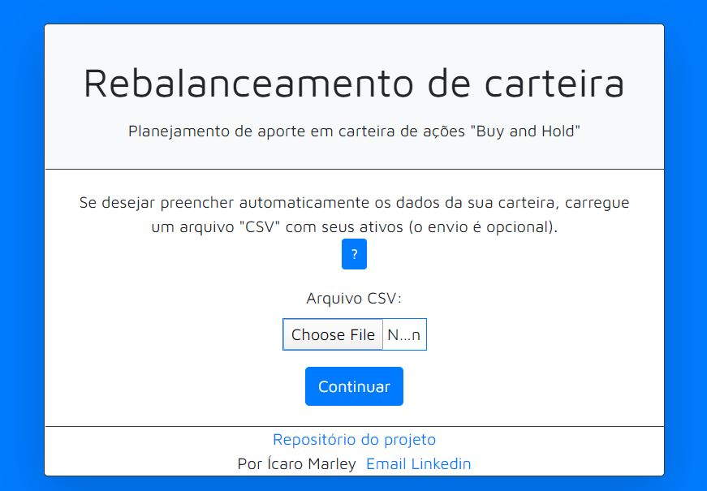
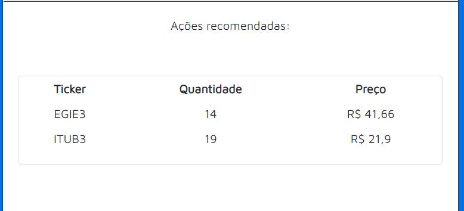
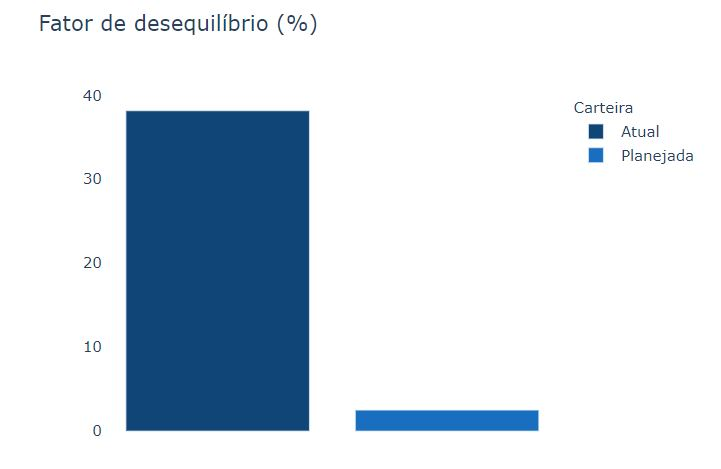
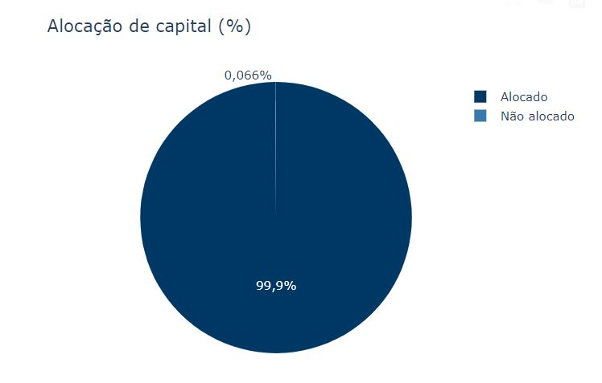
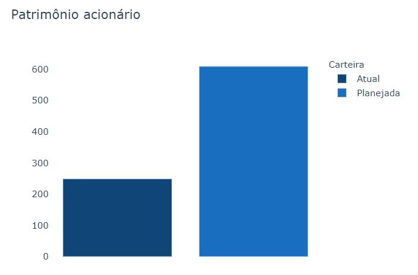

# rebalanceamento_acoes
Servidor Django para uma aplicação que planeja o rebalanceamento e o investimento de um novo aporte em uma carteira de ações da bolsa brasileira (B3). 
O que ela faz:
1. Planeja o aporte, utilizando a estratégia de "comprar o ativo mais atrasado"
2. Mostra a quantidade do aporte que foi possível alocar (considerando os preços dos ativos)
3. Faz uma comparação do desbalanceamento da carteira antes e depois do aporte
4. Mostra o patrimônio do acionista antes e depois do aporte, através do múltiplo VPA (valor patrimonial por ação)

Essa aplicação é bastante útil para adpetos da filosofia Buy and Hold pois:
1. automatiza o planejamento dos aportes (sejam eles anuais, mensais ou semanais)
2. analisa o desbalanceamento da carteira
3. mostra o patrimônio do acionista, calculado com um medidor mais estável que a precificação do mercado
4. esconde os preços dos ativos no planejamento e no cálculo de patrimônio

O projeto está hospedado no Heroku: https://rebalanceamento-acoes.herokuapp.com/
## Descrição detalhada
A aplicação recebe um arquivo de tipo CSV, gerado a partir do site do CEI (Canal Eletrônico do Investidor). 
Este arquivo é usado apenas para coletar quais ativos estão na carteira. O envio do arquivo é completamente opcional.

Após a inserção do arquivo, o usuário é redirecionado para uma tela onde é possível estabelecer as porcentagens alvo de cada ativo e o valor do aporte.

A tela final é exibida após a inserção desses dados. Nela, podem ser analisados:

* Uma tabela que mostra como alocar o aporte
* Fator de desequilíbrio, que compara um índice de desbalanceamento (soma das diferenças da % atual do ativo e a % alvo) antes e depois do planejamento
* Patrimônio acionário, que destaca a variação patrimônial antes e depois do aporte
* Composição da carteira, onde é possível comparar o balanceamento antes e depois do planejamento
* Alocação de capital, que mostra qual percentual do aporte foi possível alocar

#### Como o rebalanceamento é calculado
O rebalanceamento prioriza:
1. o maior atraso em relação à porcentagem automaticamente definida (100/número de ações), aplicada sobre o total da carteira (desconsiderando aporte) 
2. menor indicador PVP (Preço sobre valor patrimonial)

Para cada ativo, o script tenta atingir essa porcentagem (caso esteja atrasado) ou pelo menos comprar 1 ativo.

#### Como o investimento é calculado
O investimento é feito com o restante do aporte, após um rebalanceamento que concluído com sucesso (compra de todos os ativos atrasados).
Nele, apenas a maior cotação é utilizada como meio de ordenação e a porcentagem é aplicada apenas no restante do aporte.
Similar ao rebalanceamento, o objetivo é comprar pelo menos 1 ação de cada ativo.

## Principais tecnologias utilizadas: 
* Requests (Web Scraping para coletar dados de ações)
* Django (servidor web)
* Plotly (visualização de gráficos sobre a carteira)
* Pandas e Numpy (manipulação de dados) 
* Requests (Web Scraping para adquirir informações dos ativos)
* Boostrap4 e CSS (aparência do site)
* Javascript e Jquery (recurso de autofill e adicionar/remover linhas de formulário de forma dinâmica) 
* Mysql (armazena uma cache para evitar sobrecarregar sites externos na coleta de dados sobre ações)

## Telas da aplicação
* Tela inicial

* Confirmação de carteira

* Tabela de recomendações

* Gráfico de composição da carteira

* Gráfico de fator de desequilíbrio

* Gráfico de alocação do capital

* Gráfico de variação patrimonial

